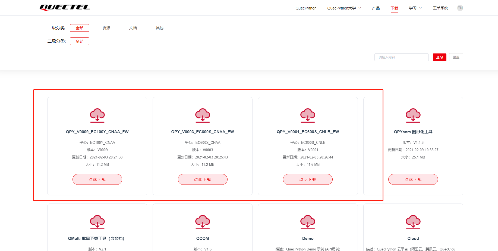
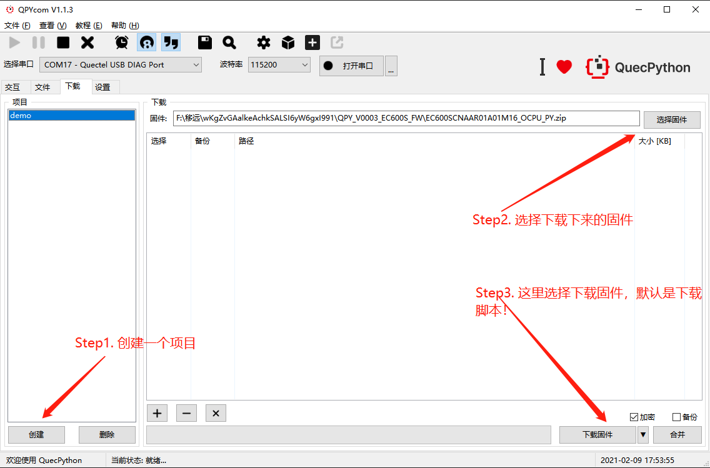

# 固件烧录

## Step1. 准备固件

进入移远[官方下载](https://python.quectel.com/download)页面，下载 `固件包` ，如下图：



其中有三个固件包，我们使用的是 `EC600S` 这个开发板，按照官方的解释，这里有两个可选固件，分别为： `QPY_V0003_EC600S_CNAA_FW` 和 `QPY_V0001_EC600S_CNLB_FW` ，这两个在初期差别不大，具体差别转至：[EC600S CNAA vs CNLB](EC600S_CNAA_vs_EC600S_CNLB.md)

这里下载 `CNAA` 版本的，解压，得到固件包： `EC600SCNAAR01A01M16_OCPU_PY.zip` ，不要再继续解压了!

## Step2. 烧录固件

打开 `QPYcom` 软件，**不要点击打开串口！不要点击打开串口！不要点击打开串口！**

操作步骤如下所示：



点击下载固件即可烧录。

> 这个步骤可能会有坑，有的时候烧录一次不成功，要再烧录一次，具体情况具体分析吧。

## Step3. 测试

打开 `交互` 窗口，输入如下测试内容：

``` python
>>> uos.listdir()
['usr', 'bak']
>>> uos.listdir('usr')
['apn_cfg.json', 'system_config.json']
>>>
```

> `uos.listdir()` 方法是查看文件和文件夹的，类似于 `linux` 下的 `ls` 命令， `Windows` 下的 `dir` 命令。
