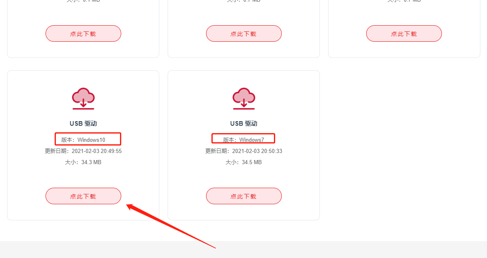
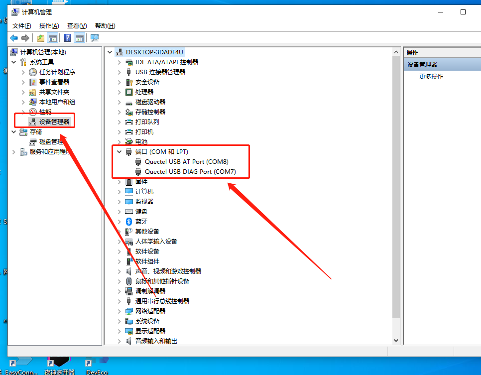
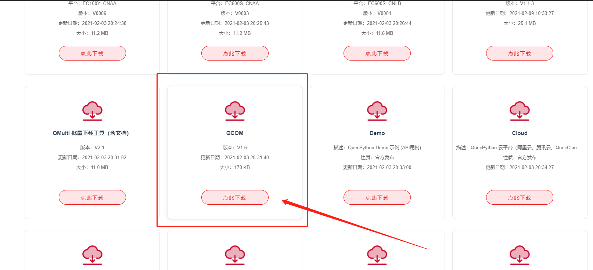
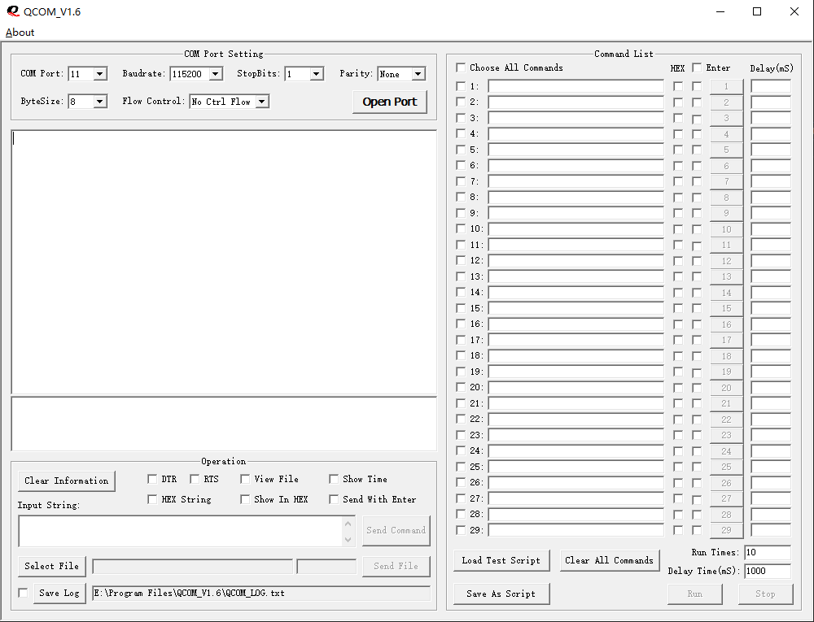
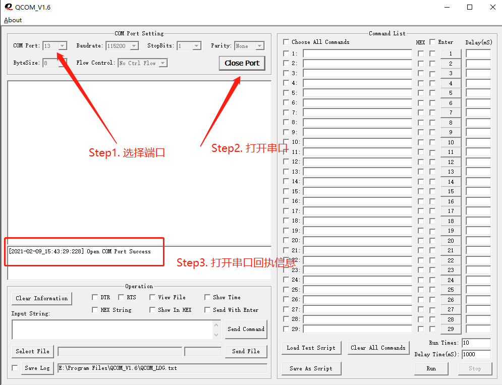
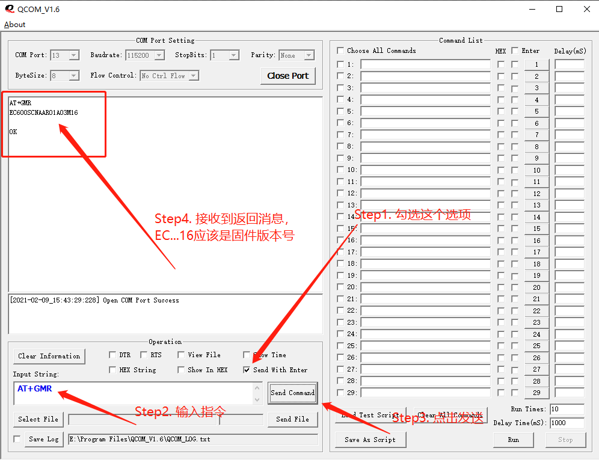

# 开发环境配置

## Step1. 驱动安装

进入移远[官方下载](https://python.quectel.com/download)页面，下载 `USB驱动` ，如下图：

注意操作系统，目前来看是没有找到 `Mac` 和 `Linux` 下的驱动，暂不知道是没有提供还是根本不需要。

双击安装即可。

* **验证是否安装成功**

将电脑与开发板连接，会发现**电源状态灯**亮起（为**红色**），之后**长按**开机按钮，大约 `5秒` 后松手，稍等 `5秒` 左右，发现**NET状态灯**开始闪烁（移远COM端口驱动，间隔大约**2秒**），进入电脑的 `设备管理器` ，查看 `端口(COM 和 LPT)` 项，发现如下图所示设备即表示安装成功！

> **温馨提示：** 在官方文档中，这里写的比较简陋，只说了将开发板与电脑连接后就能看到设备，实际发现如果不开机，是看不到设备的！还有，**官方文档中的配图显示有三个设备，实际发现只有两个**，并没有配图中提到的**指令交互串口**，产生这个现象的原因是设备在出厂的时候烧录的固件不是 `Python` 固件，在烧录完 `Python` 固件后就能看到，烧录相关请转至笔记：[固件烧录](固件烧录.md)

## Step2. QCOM软件安装

进入移远[官方下载](https://python.quectel.com/download)页面，下载 `QCOM` ，如下图：

这个下载完成后是一个压缩包，解压后双击 `QCOM_V1.6.exe` 可执行文件即可。

> **温馨提示**：这个软件运行完成后会在相同路径下生成一些其他文件，如： `Config.ini` 、 `TP.ini` 、 `QCOM_LOG.txt` 等，建议将其按照习惯整理到一个空文件夹下。

`QCOM` 软件第一次运行结果如下所示：

接下来按照官方文档测试一下

在 `设备管理器` --> `端口(COM 和 LPT)` 中找到 `Quectel USB AT Port` 的端口值，并在 `QCOM` 中选择端口，打开！注意**先不要修改其他配置**。如下所示：

> **温馨提示**：如果打开的时候打开失败，按一下**复位按钮**，带复位后再尝试连接。拿到全新开发板后未做其他修改，实测连不上，需要复位。

发送测试指令： `AT+GMR`

如上所示，能够返回**固件版本号**即表示测试成功！
