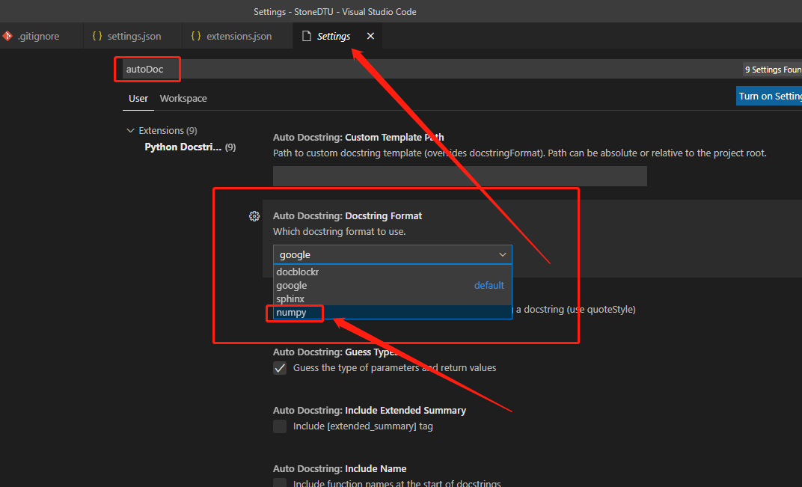
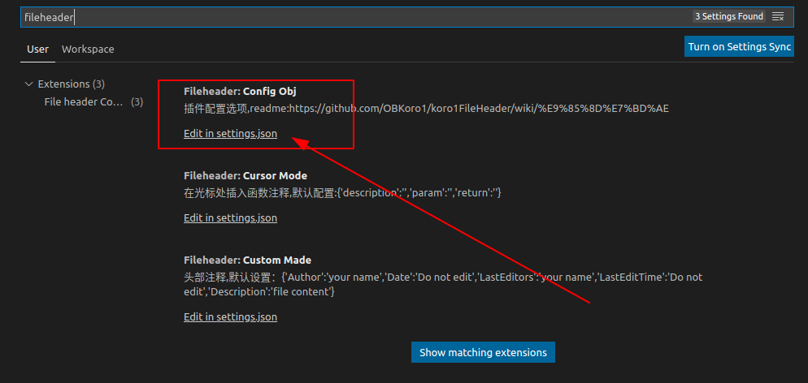
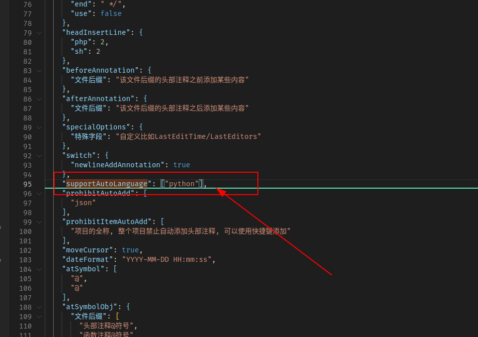
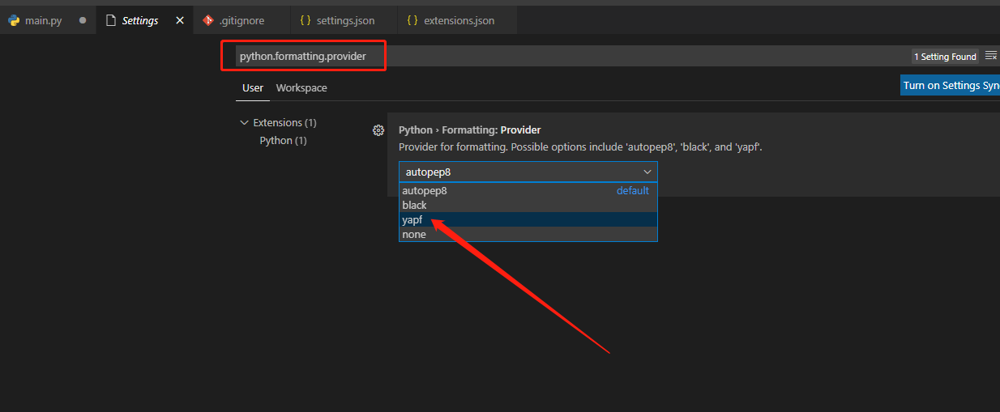

# `vscode` 工程配置

## 配置文件部分

### `.vscode/extensions.json` 文件

``` json
{
  "recommendations": [
    "streetsidesoftware.code-spell-checker",
    "wayou.vscode-todo-highlight",
    "gruntfuggly.todo-tree",
    "njpwerner.autodocstring",
    "aaron-bond.better-comments",
    "kevinrose.vsc-python-indent",
    "spywhere.guides",
    "obkoro1.korofileheader"
  ]
}
```

## 插件配置

### `Python Docstring Generator`

`Python Docstring Generator` 这个插件默认是采用 `Google` 的注释风格，但是主流用户习惯了 `numpy` 的风格，为了避免采坑，我们选择跟随主流，将 `Python` 的注释风格改为 `numpy` 风格。

在**设置页面**输入 `autoDoc` ，找到该插件的 `Auto Docstring: Docstring Format` 配置，选择 `numpy` ，如下所示：



### `koroFileHeader`

`koroFileHeader` 插件默认是支持**所有类型**文件的头部注释，但是我们通常只需要 `Python` 项目有这个东西，其他诸如 `vue` 文件， `js/ts` 文件都没有这种需求，因此需要将其配置一下，让其只支持 `Python` 文件。

在**设置页面**输入 `fileheader` ，并打开全局配置 `json` 文件，如下所示：



按照此插件官方的[配置文档](https://github.com/OBKoro1/koro1FileHeader/wiki/%E9%85%8D%E7%BD%AE)，需要找到如下配置：

``` json
"fileheader.configObj": {
    "supportAutoLanguage": [ ] // 设置过后只有该数组里面的文件 才会自动添加头部注释
}
```

最终配置如下：



### YAPF

要把 `Python` 代码写漂亮，必须遵循 `PEP8 Python` 编码规范：《[PEP 8 -- Style Guide for Python Code](https://www.python.org/dev/peps/pep-0008/)》。但记住 `PEP8` 规范，是一件非常痛苦的事情，还好 `Google` 发布了一个自动整理 `Python` 代码，让其符合 `PEP8` 规范的工具： `YAPF` 。

安装：

``` shelll
$ pip install yapf
```

配置：

打开设置页面，输入： `python.formatting.provider` ，将代码风格选择为 `yapf` ，如下所示：


