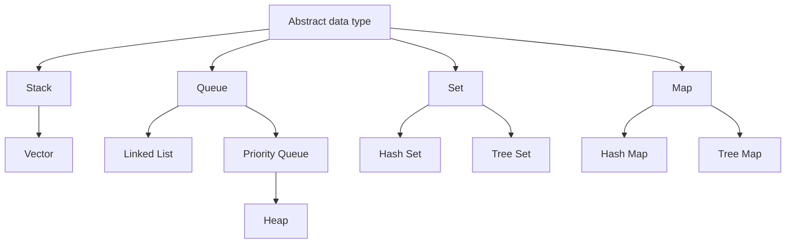

# 数据结构知识架构图

```mermaid
graph TD;
    Root[Abstract data type] --> L1[Stack];
    L1 --> L1-2[Vector];
    Root --> L2[Queue];
    L2 --> L2-1[Linked List];
    L2 --> L2-2[Priority Queue];
    L2-2 --> L2-3[Heap];
    Root --> L3[Set];
    L3 --> L3-1[Hash Set];
    L3 --> L3-2[Tree Set];
    Root --> L4[Map];
    L4 --> L4-1[Hash Map];
    L4 --> L4-2[Tree Map];
```
