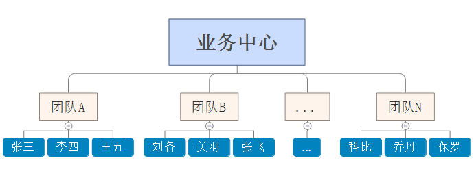

# RBAC 权限设计 扩展篇

## 用户-组织-角色-权限

很多情况下数据之间是有隔离需求的，尽管不同的角色都有相同的权限，但是可能有权查看到的数据范围就不同了。

假设上图是一家公司业务部门的组织架构图，公司要求你基于这个组织架构设计一个业务管理系统，并要求系统需要满足不同用户的数据私密性，比如：“张三”登录时，只能看到“张三”负责的数据；“张三”的领导登录时，能看到“团队A”的所有业务员负责的数据，但看不到其他团队业务员负责的数据等等。

在这种情况下，RBAC就无法满足需求了，我们需要自行扩展，来设计出符合我们需求的权限架构。

在“用户-角色-权限”的基础上，我们增加了用户与组织的关联关系， `组织决定了用户的数据可视权限` 。但要想真正达到这个效果，我们还需要做2件事：

1. `组织层级划分` : 如下图，我们需要对组织进行梳理，并划分层级；

   

2. `数据可视权限规则制定` : 比如：上级组织职能看到下级组织员工负责的数据，而不能看到其他平级组织及其下级组织的员工数据等。

## 用户-组织-岗位-角色-权限

增加岗位的好处：

1. `识别用户的主要身份` 。一个人可能身兼多职（多个角色），但是他的主要职能是固定的，那怎么告诉系统用户的主要职能是什么呢？答案就是：通过岗位！拿上面的小马哥举例：小马哥虽然身兼经理和财务两种身份，但他的本职工作是“经理”，因此，他的系统岗位应该“经理”。当他登录时，系统会识别他的身份为“经理”，只不过这个“经理”刚好兼具了其他岗位的职能而已；
2. `通过“组织-岗位”关联，快速甄别用户岗位` 。公司在不断地发展的过程中，系统的用户角色也会不断增加，当角色达到一定数量以后，管理员每新增一个用户都要花相当的时间去寻找角色。引入岗位后，可将组织和岗位、岗位和角色提前进行关联，配置账号时，管理员只要选定组织，系统就给出与该组织关联的岗位，而这些岗位，又是提前关联好角色的，选择起来，既方便又高效！
