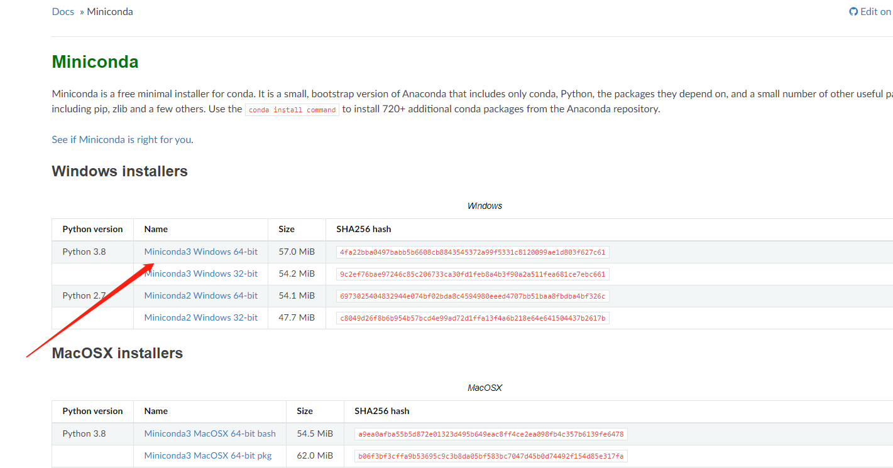
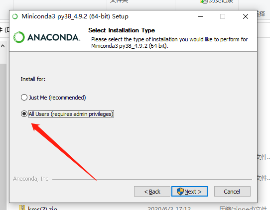
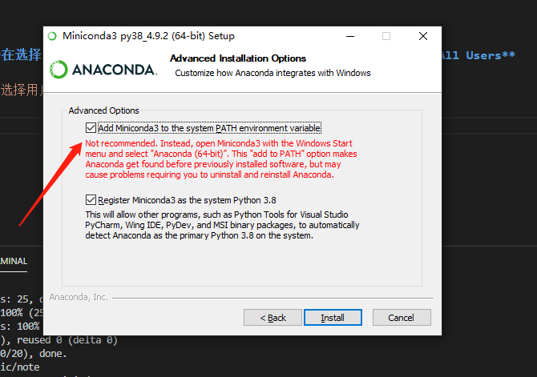

# Miniconda Windows 安装

## `Step1.` 下载安装包

下载安装即可，[官方地址](https://docs.conda.io/en/latest/miniconda.html)



`注意：` 需要选择合适的版本。

## Step2. 安装

双击安装，注意**在选择用户的时候不要默认！**，默认选择的是**Just Me**，我们选择**All Users**



**勾选**配置环境变量，注意看这个选框官方的建议是**不勾选**的，也说明了原因，我们这里还是要勾选，很多教程都是一路默认，然后安装完回过头来继续配置环境变量，这样做岂不是多此一举？



安装完成

## Step3. 检验

打开 `cmd终端` ，输入 `conda` ，检验输出，正常的话，应该是有如下输出的：

``` shell
$ conda
usage: conda-script.py [-h] [-V] command ...

conda is a tool for managing and deploying applications, environments and packages.

Options:

positional arguments:
  command
    clean        Remove unused packages and caches.
    compare      Compare packages between conda environments.
    config       Modify configuration values in .condarc. This is modeled after the git config command. Writes to the
                 user .condarc file (C:\Users\Iric\.condarc) by default.
    create       Create a new conda environment from a list of specified packages.
    help         Displays a list of available conda commands and their help strings.
    info         Display information about current conda install.
    init         Initialize conda for shell interaction. [Experimental]
    install      Installs a list of packages into a specified conda environment.
    list         List linked packages in a conda environment.
    package      Low-level conda package utility. (EXPERIMENTAL)
    remove       Remove a list of packages from a specified conda environment.
    uninstall    Alias for conda remove.
    run          Run an executable in a conda environment. [Experimental]
    search       Search for packages and display associated information. The input is a MatchSpec, a query language
                 for conda packages. See examples below.
    update       Updates conda packages to the latest compatible version.
    upgrade      Alias for conda update.

optional arguments:
  -h, --help     Show this help message and exit.
  -V, --version  Show the conda version number and exit.

conda commands available from other packages:
  env
```

## Step4. 换源

`采坑提示：` 这里千万不要用清华的镜像源，因为它不更新了。。。使用中科大的。

打开终端，输入如下命令：

``` shell
$ conda config --add channels https://mirrors.ustc.edu.cn/anaconda/pkgs/free/
$ conda config --set show_channel_urls yes
```
