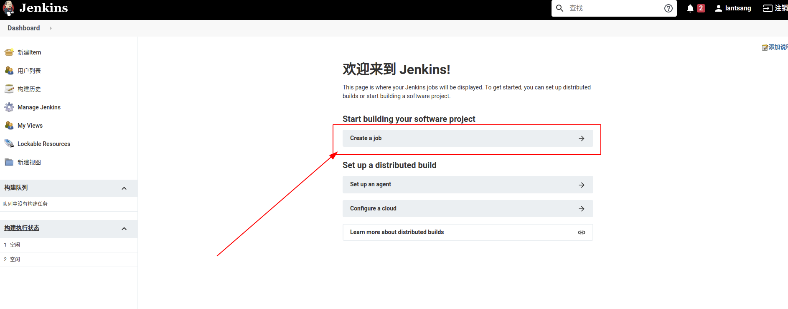
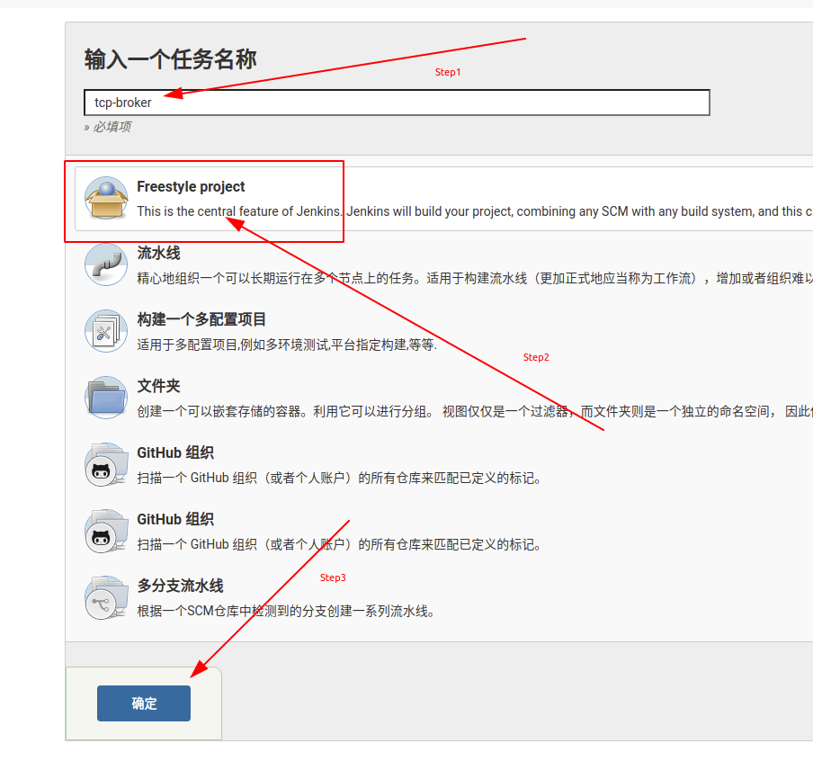

# Jenkins `NestJS` 项目配置

## 环境准备

本笔记是在一个全新的系统上开始的，版本为： `2.263.1` 。安装方式为 `Docker` ，采用魔改版安装。[安装笔记](../Docker安装.md)

* [配置SSH key](../配置ssh_key.md)
* [集成私有Gitlab](../集成私有Gitlab.md)
* [配置nodejs环境](配置nodejs.md)

## 构建项目

如下图所示，进入 `job` 创建页面

创建一个**自由风格**的项目。（以**透传云**的[tcp-broker](https://gitlab.lantsang.cn/xcloud/tcp-broker)项目为例）

接下来的构建方式有多种，有基于 `分支` 的（例如： `master` 或 `development` 分支代码变动后构建），有基于 `Merge Request` 的（例如：有人提交了 `Merge Request` 之后开始构建，场景为自动化代码测试，之后通过邮件通知开发者），有基于 `tag` 的（ `tag` 通常与 `release` 相近，表示发布版本，这个很符合软件发布的思想）。

由于构建方式众多，而且每种方式的笔记篇幅不会太少，因此拆分到独立的笔记。

* [基于tag构建](基于tag构建.md)
* [基于分支构建](基于分支构建.md)
