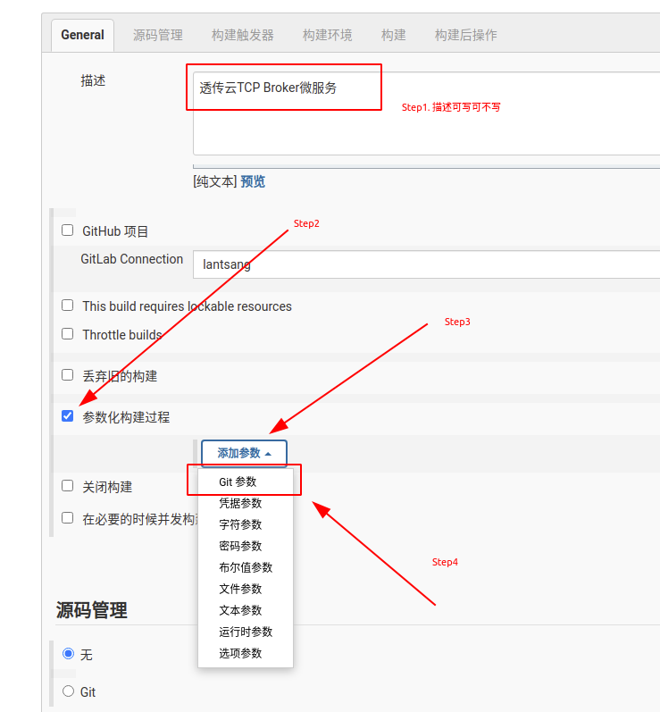
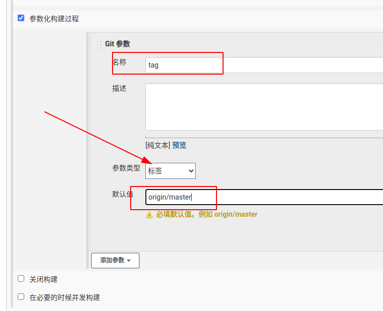
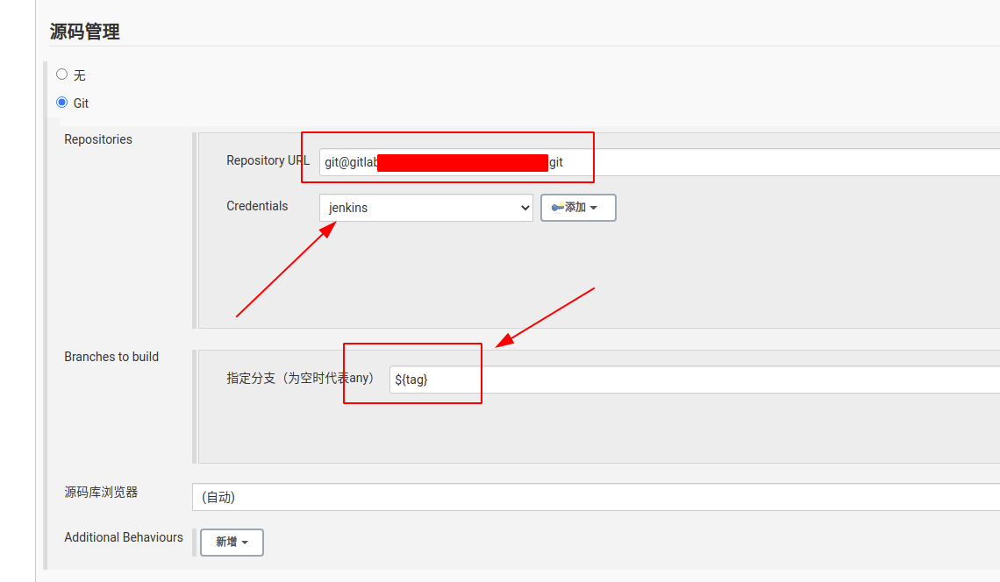
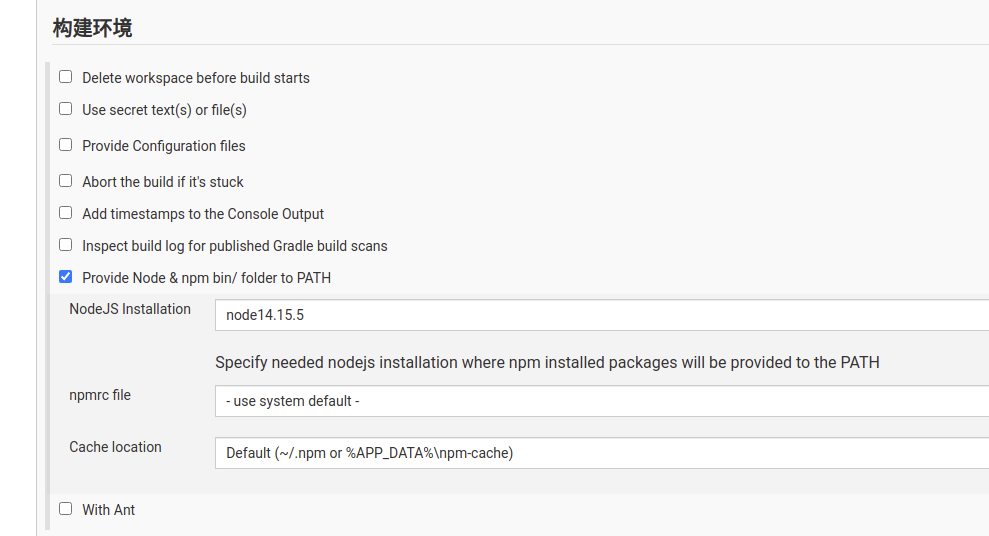
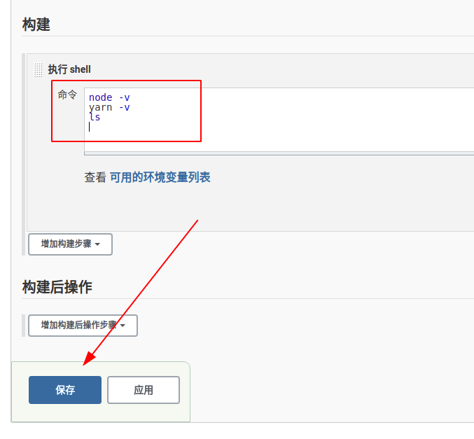

# Jenkins `NestJS` 项目配置——基于 `tag` 构建

承接笔记：[Jenkins构建nestjs项目](README.md)

## `Step1.` 配置参数化构建过程

之后配置**Git参数**，如下图所示：

## `Step2.` 配置 `Gitlab` 仓库访问

仓库地址填写 `ssh` 路径，不要写 `http` ， `Credentials` 为系统中配置的 `ssh key` 用户（来源于笔记：[配置SSH key](../配置ssh_key.md)）

`注意：` 如果配置不正确，这里面是会报错的，页面上能够明显看到。发现报错也不要过于着急，因为它有延迟，可能等一分钟左右就消失了。记得验证有延时即可（猜测是采用时间轮询验证的）

接下来 `Branches to build` 栏中 `指定分支（为空时代表any）` 字段填写： `${tag}`

## `Step3.` 添加 `nodejs` 环境

这个功能在前面的基础笔记中已经讲过了，不再赘述，可参考笔记：[配置nodejs](配置nodejs.md)

## `Step4.` 构建执行 `shell`

在**构建**中，增加**构建步骤**，选择**执行shell**，这里仅仅是做一个笔记教程，所以只执行三个命令： `node -v` 、 `yarn -v` 和 `ls`

接下来点击保存即可。
