# `Jenkins` 配置 `NodeJS`

## 安装 `NodeJS` 插件

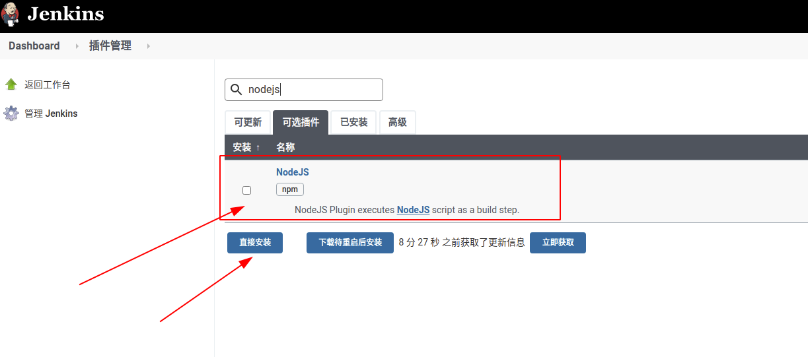

## 配置环境

首先，进入 `Jenkins` **全局配置**界面。

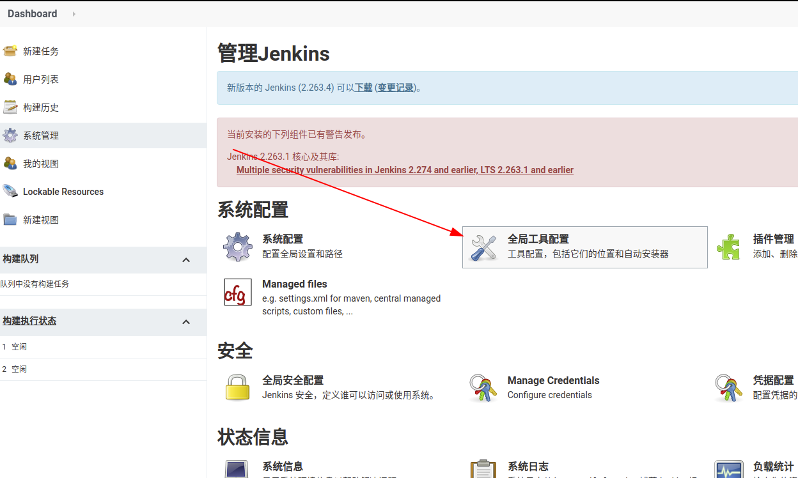

配置 `node` 版本。如下图所示

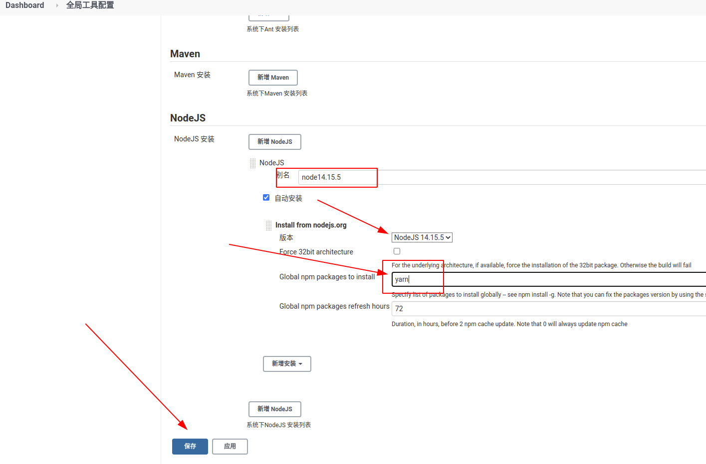

点击 `保存` 按钮即可完成配置。

## 测试

首先建立一个名为 `node-test` 的自由风格工程，用来测试 `node` 环境是否配置成功。

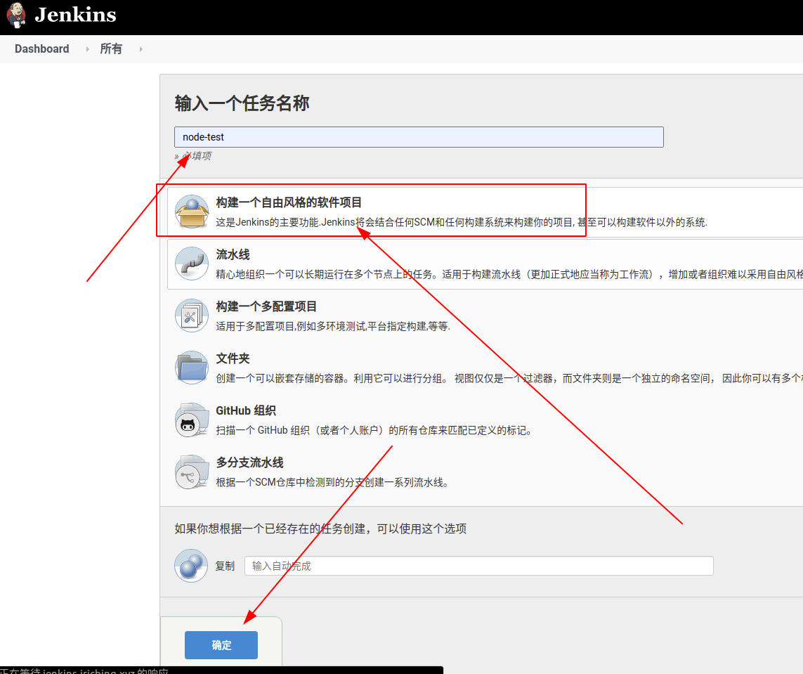

接下来在**环境构建**栏开启 `Provide Node & npm bin/ folder to PATH` 选项，如果上一步配置正常，它应该会自动回填 `node` 信息。

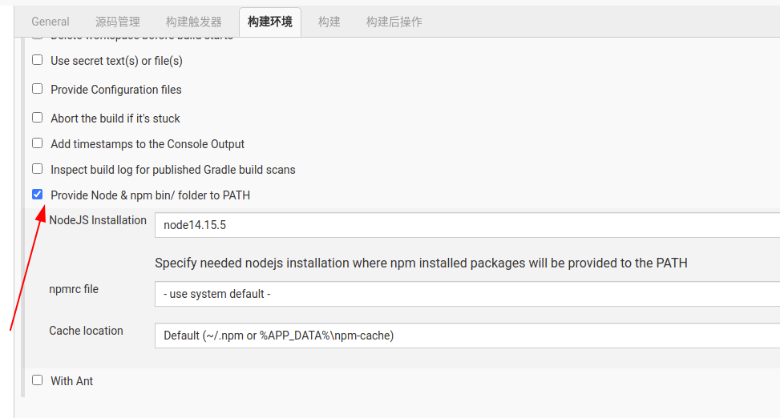

然后**增加构建步骤**，选择 `执行shell` 。

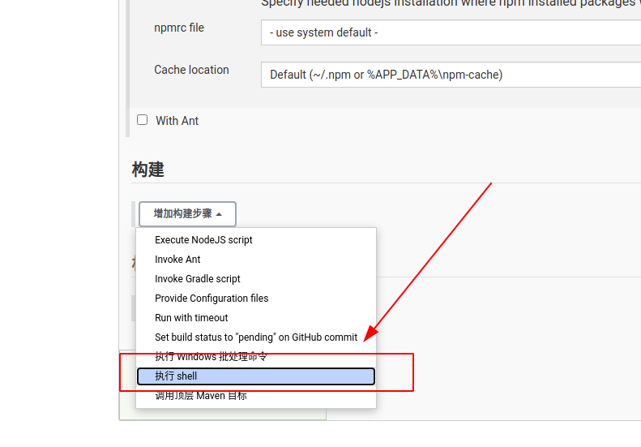

在**执行shell命令**中输入 `node -v` 。

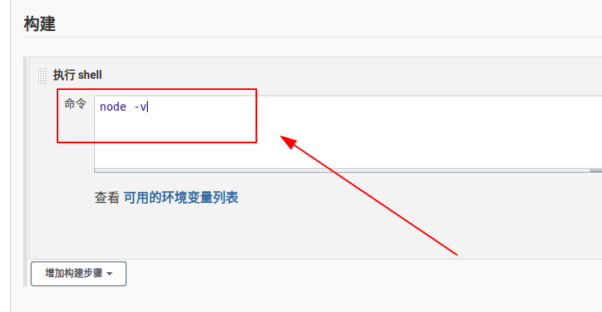

最后点击 `保存` 按钮，工程创建完成!

工程创建完成后会自动跳转到工程详情页面，点击左侧菜单栏中的 `立即构建` 按钮，即可进行构建。

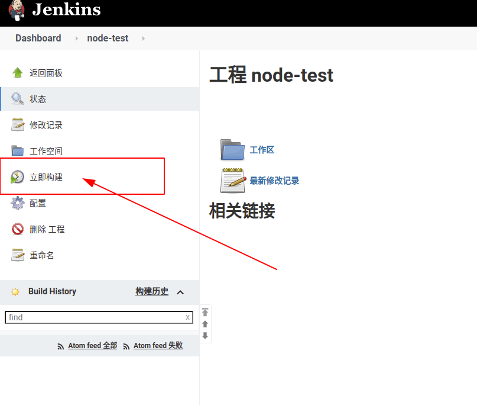

构建完成后会在 `Build History` 栏中显示构建版本，点击此次构建，进入构建信息页面。

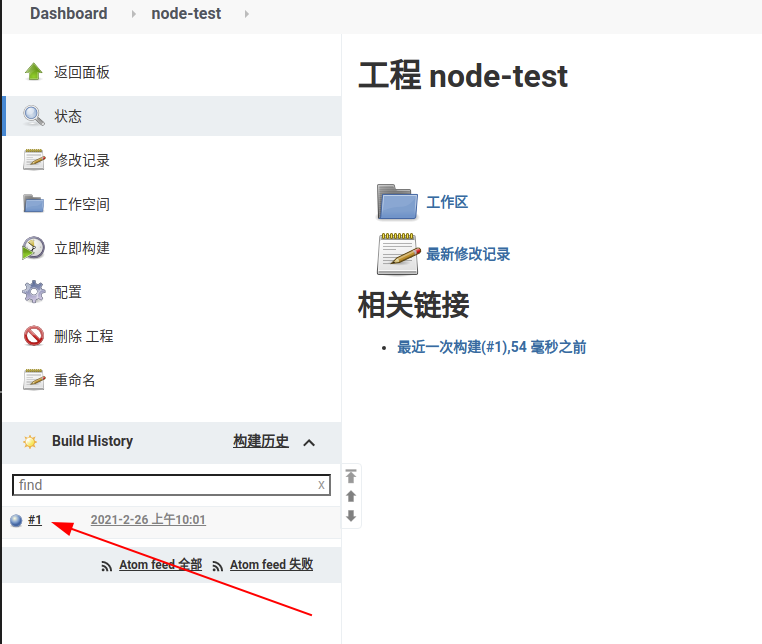

接下来通过左侧的 `控制台输出` 按钮就能看到编译构建信息了。

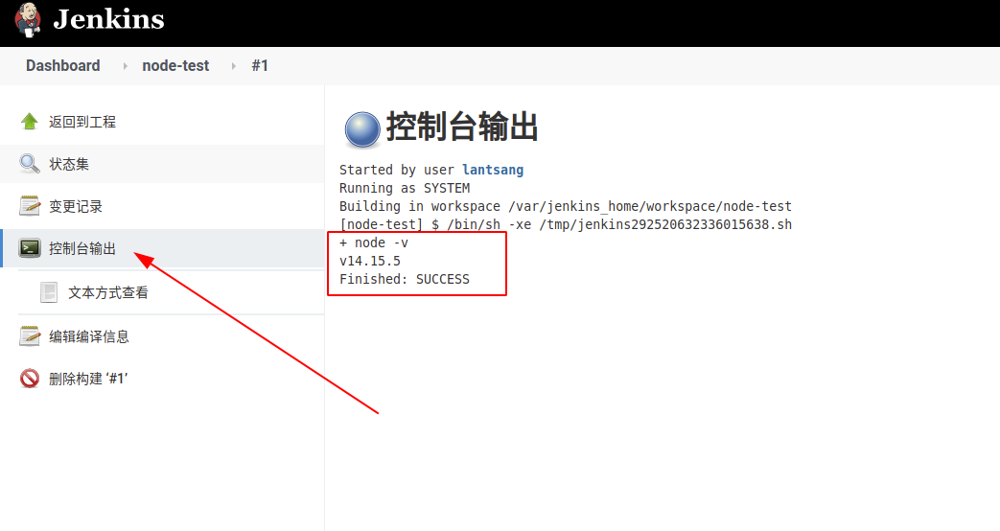

## 预装包测试

有时候，项目会依赖一些预装包，最典型的就是 `yarn` 。上面已经测试了 `node` 配置，接下来测试一下 `yarn` 配置。

在工程**构建**命令中加入 `yarn -v` 命令，如下所示：

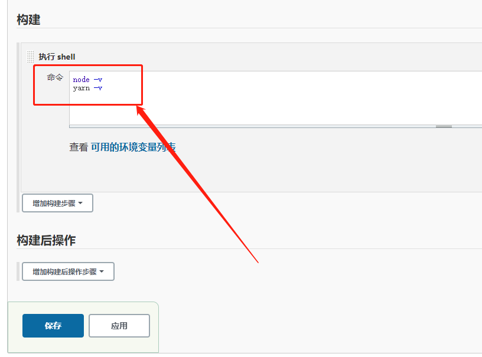

接下来**手动执行构建**，并查看控制台输出结果，如下所示即表示成功：

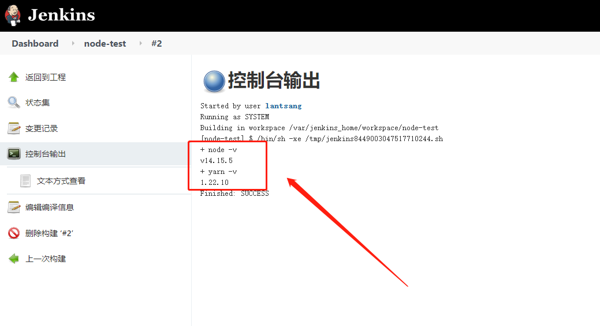
