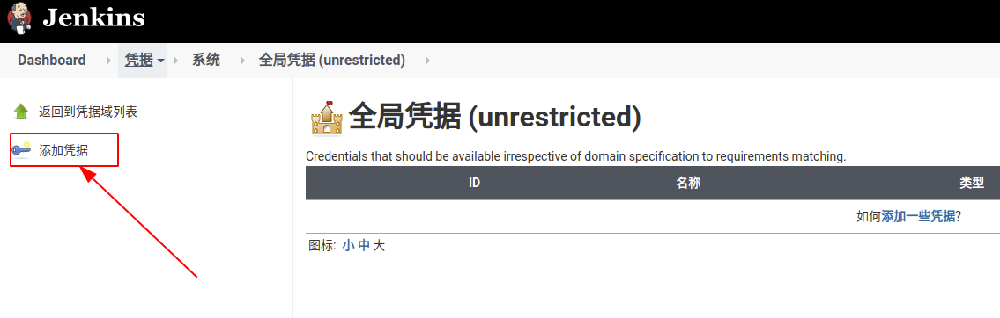
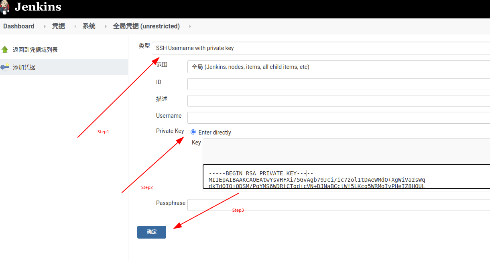

# Jenkins 配置 `ssh key`

## 为什么要配置

`Jenkins` 作为 `CI/CD` 的一个优秀实现工具，必然会与**代码仓库**打交道。现在 `Git` 作为主流的代码仓库，主流方式一般都是通过 `ssh key` 来作为访问凭证的。当然由于 `Jenkins` 的**特殊性**，使用 `web hook` 的方式同样能起到代码通知的目的。

## 配置流程

因为是通过 `Docker` 来安装的 `Jenkins` 服务，所以 `Jenkins` 与主机是隔离的，不能共享 `ssh key` ，需要在容器中去单独配置。

### `Step1.` 登录容器

``` shell
$ docker ps
CONTAINER ID        IMAGE                                                    COMMAND                  CREATED             STATUS              PORTS                                              NAMES
95a6f3b7fa4a        registry.cn-hangzhou.aliyuncs.com/lantsang/jenkins:lts   "/sbin/tini -- /usr/…"   2 hours ago         Up 2 hours          0.0.0.0:8080->8080/tcp, 0.0.0.0:50000->50000/tcp   jenkins

$ docker exec -it 95a6f3b7fa4a bin/bash
jenkins@95a6f3b7fa4a:/$ 
```

### `Step2.` 生成 `ssh key`

``` shell
jenkins@95a6f3b7fa4a:/$ cd ~    # 首先切换到用户目录

jenkins@95a6f3b7fa4a:~$ ssh-keygen  # 重新生成ssh key

jenkins@95a6f3b7fa4a:~$ cat .ssh/id_rsa.pub     # 查看生成的ssh key
```

### `Jenkins` 添加凭证

首先进入 `Jenkins` **全局凭证管理**页面。



之后点击 `添加凭据` 按钮，并安装下图所示添加 `SSH凭据` ，其中 `Private Key` 的值来自于容器中的 `~/.ssh/id_rsa` 私钥文件。



点击 `确定` 按钮即可完成添加。
