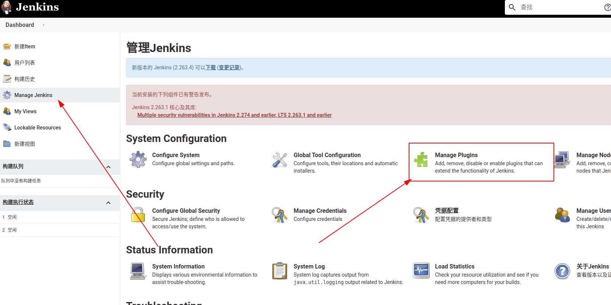
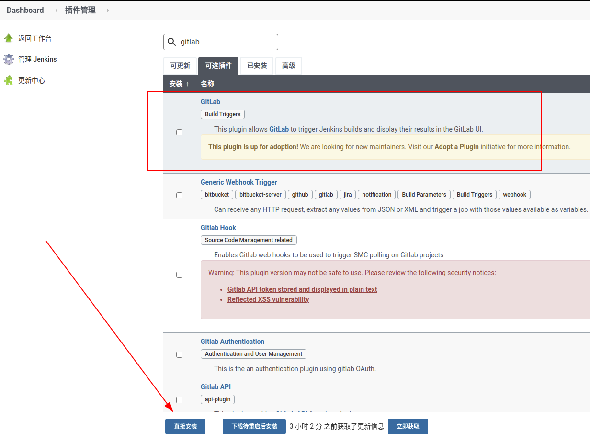
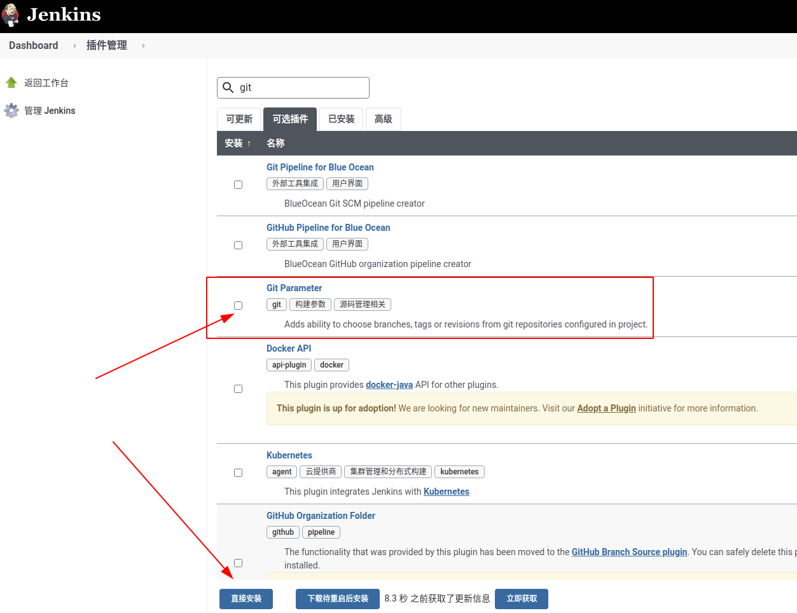
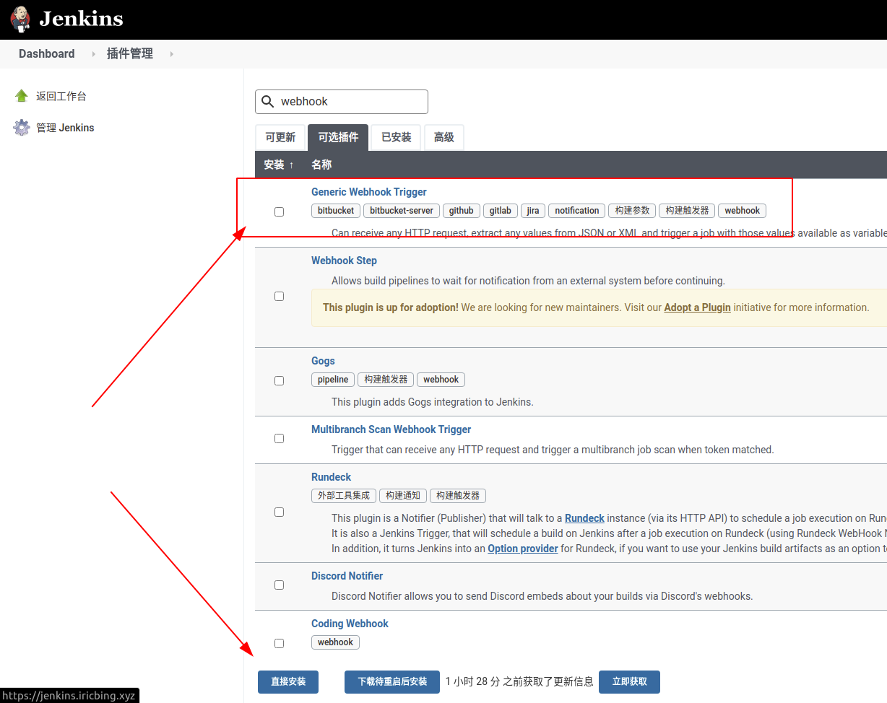
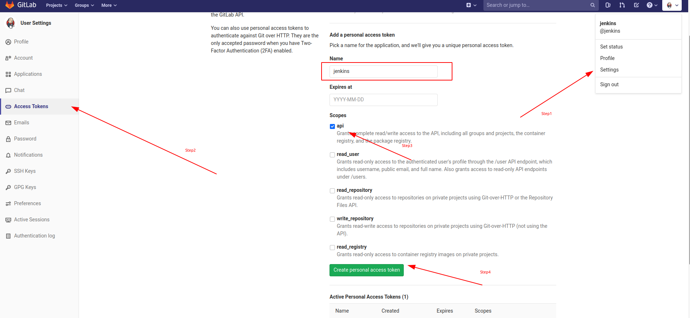
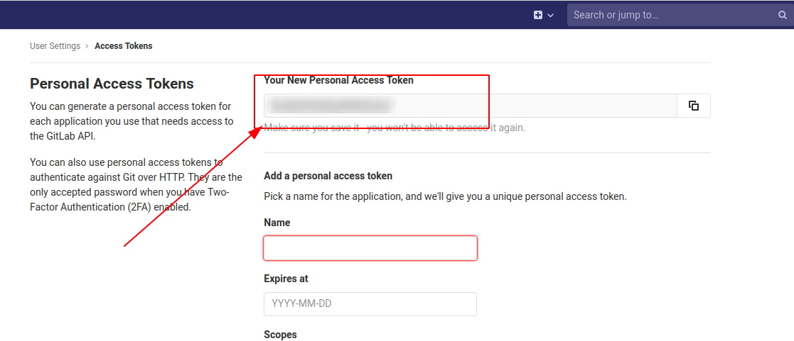
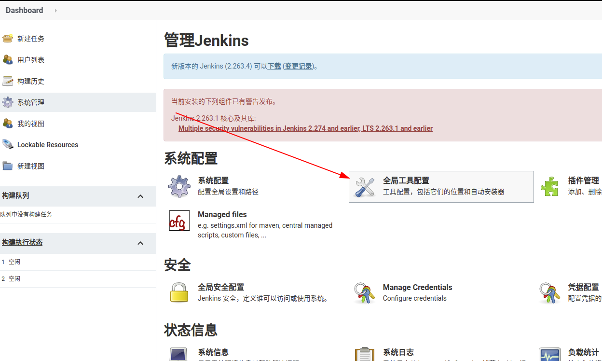
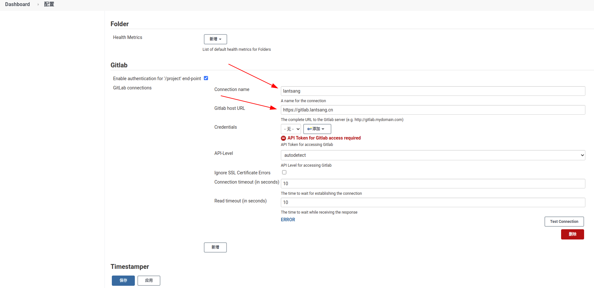
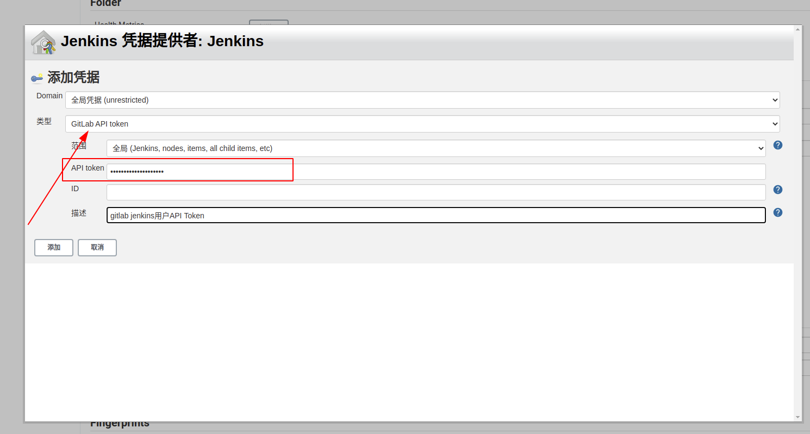
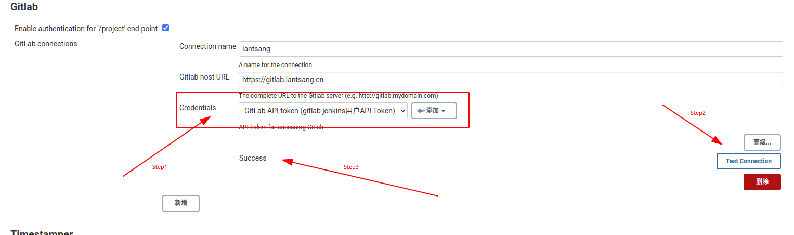

# `Jenkins` 集成私有 `Gitlab`

## 插件安装

首先进入 `Jenkins` 的插件管理界面。

安装 `GitLab` 插件。

安装 `Git Parameter` 插件。

安装 `Generic Webhook Trigger` 插件。

## 插件配置

### `Gitlab` 创建 `Access Token`

如下图所示，在 `Gitlab` 中创建用户的 `Access Token`

创建后会在页面上显示 `Access Token` ，这个在后面会用到。

### `Jenkins` 全局配置

进入 `Jenkins` 全局配置页面

填写 `Connection name` 和 `Gitlab host URL` 字段。

添加 `Credentials` 。配置 `API Token` 凭证。

之后选择新建的凭证，并进行测试，如下所示：

上图返回了 `Success` ，表示成功了！

最后，点击页面下方的 `保存` 按钮即可配置完成！
