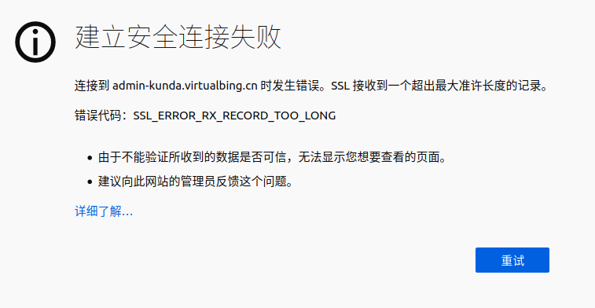
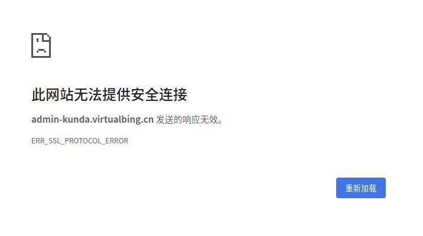

# `SSL` 接收到一个超出最大准许长度的记录 错误处理

上图：（火狐浏览器效果）



`注意：` Chrome浏览器对于这个错误的提示很不友好，页面如下所示：



## 产生原因

是因为 `配置文件写错了` **写了ssl相关的，却没有开启ssl导致的。**

**排查目标：**

```conf
server {
    listen 443 ssl;

    ssl_certificate ...
    ssl_certificate_key ...
}
```
